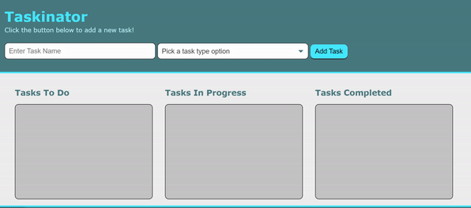

## Taskinator

**Project Description/Summary:**

Creating a Kanban style work tracker - this can be used for existing tasks and leverages localStorage to edit or delete tasks.

---

**Live Site:**

Head over to https://cwarmbrunn.github.io/taskinator/ to view the page live!

---

**Technology Used:**

- JavaScript
- CSS
- HTML

---

**Installation:**

You can clone this repo - no special instructions to load this!

---

**Screenshots:**

